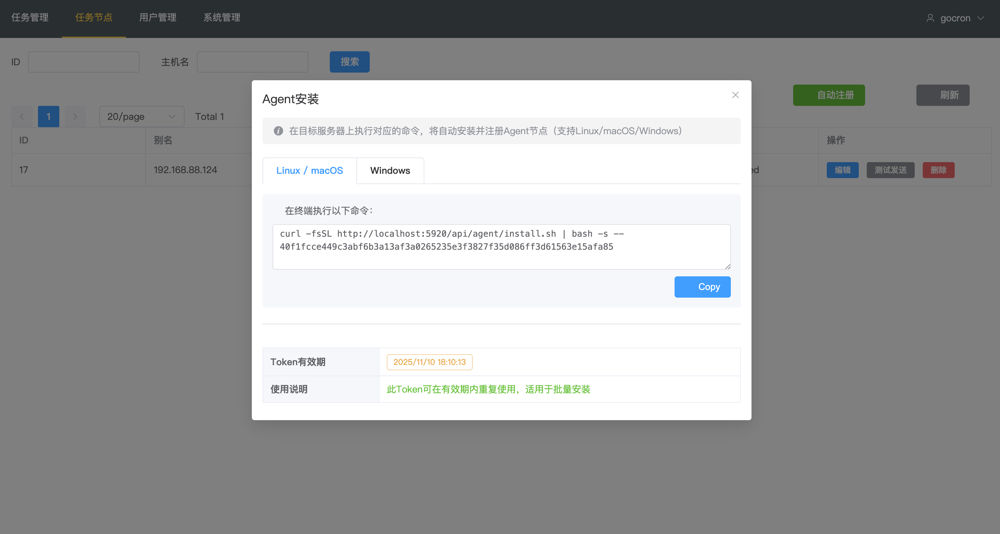

# gocron - 分布式定时任务管理系统

[](https://github.com/gocronx-team/gocron/releases) [](https://github.com/gocronx-team/gocron/releases) [](https://github.com/gocronx-team/gocron/blob/master/LICENSE)

[English](README_EN.md) | 简体中文

使用 Go 语言开发的轻量级分布式定时任务集中调度和管理系统，用于替代 Linux-crontab。

## 📖 文档

访问完整文档请跳转：[文档](https://gocron-docs.pages.dev)

- 🚀 [快速开始](https://gocron-docs.pages.dev/zh/guide/quick-start) - 安装部署指南
- 🤖 [Agent 自动注册](https://gocron-docs.pages.dev/zh/guide/agent-registration) - 一键部署任务节点
- ⚙️ [配置文件](https://gocron-docs.pages.dev/zh/guide/configuration) - 详细配置说明
- 🔌 [API 文档](https://gocron-docs.pages.dev/zh/guide/api) - API 接口说明

## ✨ 功能特性

* **Web 界面管理**：直观的定时任务管理界面
* **秒级定时**：支持 Crontab 时间表达式，精确到秒
* **分布式架构**：Master-Worker 架构，支持多节点高可用
* **任务重试**：支持任务执行失败重试设置
* **任务依赖**：支持配置任务依赖关系
* **多用户权限**：完善的用户和权限控制
* **双因素认证**：支持 2FA，提升系统安全性
* **Agent 自动注册**：支持 Linux/macOS 一键安装注册
* **多数据库支持**：MySQL / PostgreSQL / SQLite
* **日志管理**：完整的任务执行日志，支持自动清理
* **消息通知**：支持邮件、Slack、Webhook 等多种通知方式

## 🚀 快速开始 (Docker)

最简单的部署方式是使用 Docker Compose：

```bash
# 1. 克隆项目
git clone https://github.com/gocronx-team/gocron.git
cd gocron

# 2. 启动服务
docker-compose up -d

# 3. 访问 Web 界面
# http://localhost:5920
```

更多部署方式（二进制部署、开发环境）请查看 [安装部署指南](https://gocron-docs.pages.dev/zh/guide/quick-start)。

## 📸 界面截图





## 🤝 贡献

我们非常欢迎社区的贡献！

- 🐛 **提交 Bug**：请在 GitHub Issues 中提交
- 💡 **提交代码**：请遵循 [贡献指南](https://gocron-docs.pages.dev/zh/guide/contributing) 提交 PR

## 📄 许可证

本项目遵循 MIT 许可证。详情请见 [LICENSE](LICENSE) 文件。

## Star History

[](https://www.star-history.com/#gocronx-team/gocron&Date)