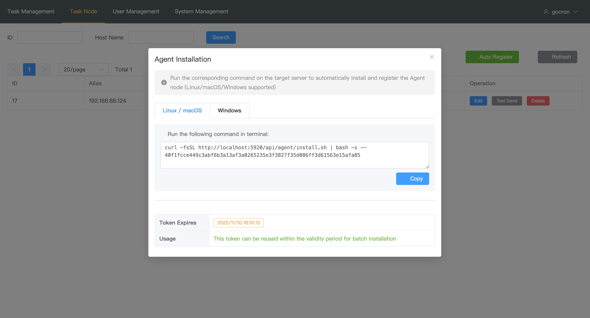
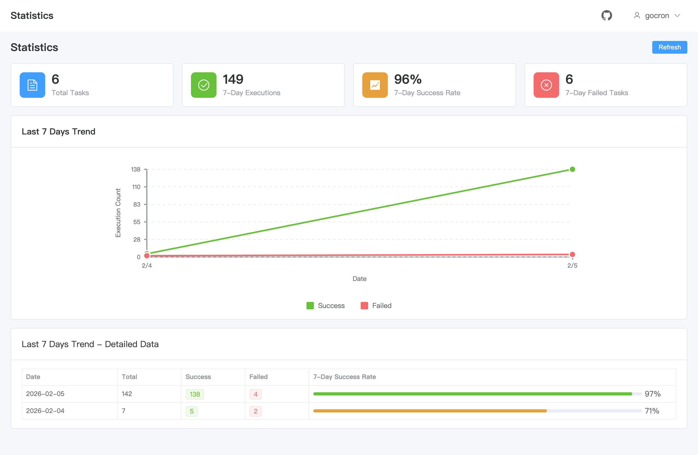

# gocron - Distributed Task Scheduler

[](https://github.com/gocronx-team/gocron/releases) [](https://github.com/gocronx-team/gocron/releases) [](https://github.com/gocronx-team/gocron/blob/master/LICENSE)

English | [简体中文](README_ZH.md)

A lightweight distributed scheduled task management system developed in Go, designed to replace Linux-crontab.

## 📖 Documentation

Full documentation is available at: **[document](https://gocron-docs.pages.dev/en/)**

- 🚀 [Quick Start](https://gocron-docs.pages.dev/en/guide/quick-start) - Installation and deployment guide
- 🤖 [Agent Auto-Registration](https://gocron-docs.pages.dev/en/guide/agent-registration) - One-click task node deployment
- ⚙️ [Configuration](https://gocron-docs.pages.dev/en/guide/configuration) - Detailed configuration guide
- 🔌 [API Documentation](https://gocron-docs.pages.dev/en/guide/api) - API reference

## ✨ Features

- **Web Interface**: Intuitive task management interface
- **Second-level Precision**: Supports Crontab expressions with second precision
- **Distributed Architecture**: Master-Worker architecture, high availability
- **Task Retry**: Configurable retry policies for failed tasks
- **Task Dependency**: Supports task dependency configuration
- **Access Control**: Comprehensive user and permission management
- **2FA Security**: Two-Factor Authentication support
- **Agent Auto-Registration**: One-click installation for Linux/macOS
- **Multi-Database**: MySQL / PostgreSQL / SQLite support
- **Log Management**: Complete execution logs with auto-cleanup
- **Notifications**: Email, Slack, Webhook support

## 🚀 Quick Start (Docker)

The easiest way to deploy is using Docker Compose:

```bash
# 1. Clone the project
git clone https://github.com/tabortao/gocron.git
cd gocron

# 2. Start services
docker-compose up -d

# 3. Access Web Interface
# http://localhost:5920
```

For more deployment methods (Binary, Development), please refer to the [Installation Guide](https://gocron-docs.pages.dev/en/guide/quick-start).

## 📸 Screenshots

<p align="center">
  <b>Scheduled Tasks</b><br>
  
</p>

<table>
  <tr>
    <td width="50%" align="center"><b>Agent Auto-Registration</b></td>
    <td width="50%" align="center"><b>Task Management</b></td>
  </tr>
  <tr>
    <td></td>
    <td></td>
  </tr>
</table>

<table>
  <tr>
    <td width="50%" align="center"><b>Statistics</b></td>
    <td width="50%" align="center"><b>Notifications</b></td>
  </tr>
  <tr>
    <td></td>
    <td></td>
  </tr>
</table>

## 🤝 Contributing

We warmly welcome community contributions!

### How to Contribute

1. **Fork the repository**
2. **Clone your fork**

   ```bash
   git clone https://github.com/YOUR_USERNAME/gocron.git
   cd gocron
   ```

3. **Install dependencies**

   ```bash
   pnpm install
   pnpm run prepare
   ```

4. **Create a feature branch**

   ```bash
   git checkout -b feature/your-feature-name
   ```

5. **Make your changes and commit**

   ```bash
   git add .
   pnpm run commit  # Use interactive commit tool
   ```

6. **Push and create a Pull Request**
   ```bash
   git push origin feature/your-feature-name
   ```

### Commit Message Guidelines

This project uses [commitizen](https://github.com/commitizen/cz-cli) and [cz-git](https://cz-git.qbb.sh/) for standardized commit messages with emoji prefixes.

Instead of `git commit`, use:

```bash
pnpm run commit
```

This will guide you through an interactive prompt to create properly formatted commit messages like:

- ✨ feat(task): add task dependency configuration
- 🐛 fix(api): fix task status update issue
- 📝 docs: update API documentation

### Other Ways to Contribute

- 🐛 **Report Bugs**: Please submit via GitHub Issues
- 💡 **Feature Requests**: Share your ideas through Issues
- 📝 **Documentation**: Help improve our documentation

## 📄 License

This project is licensed under the MIT License. See the [LICENSE](LICENSE) file for details.

## Star History

[](https://www.star-history.com/#gocronx-team/gocron&Date)
