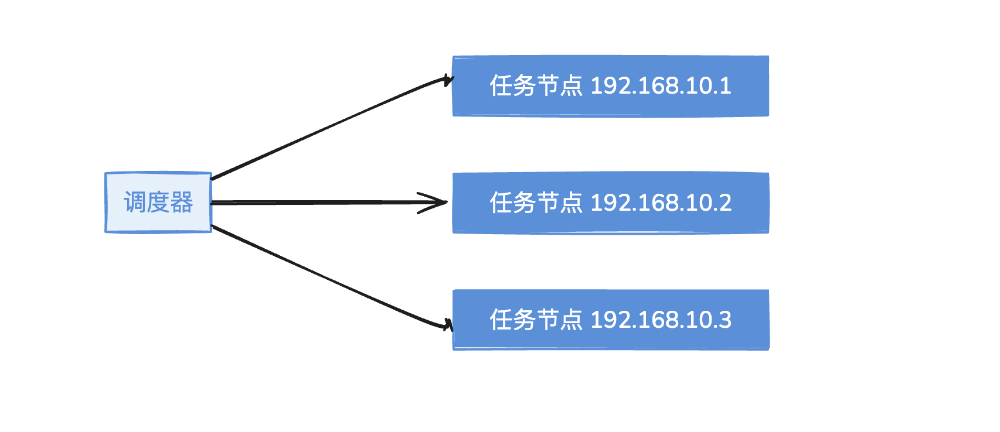
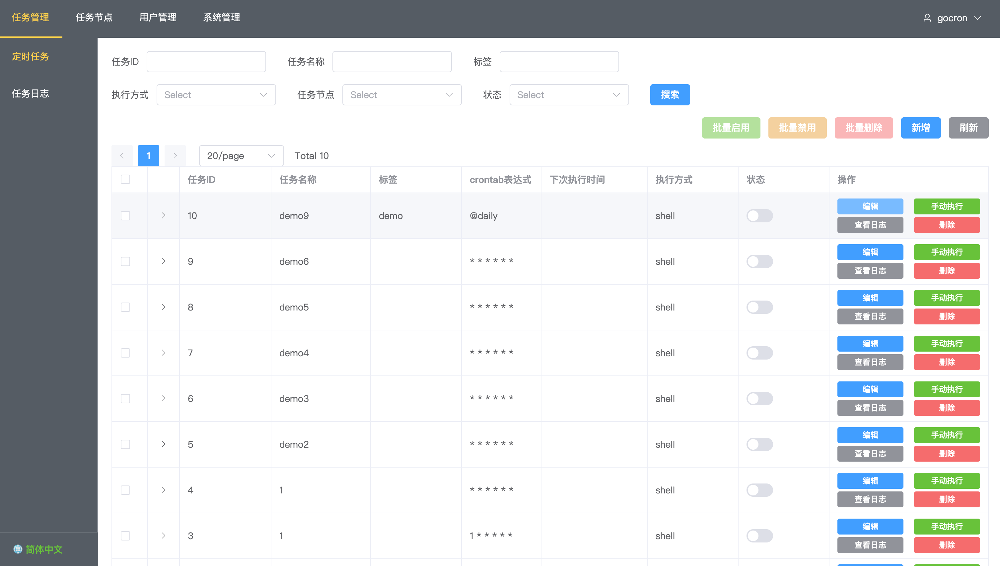
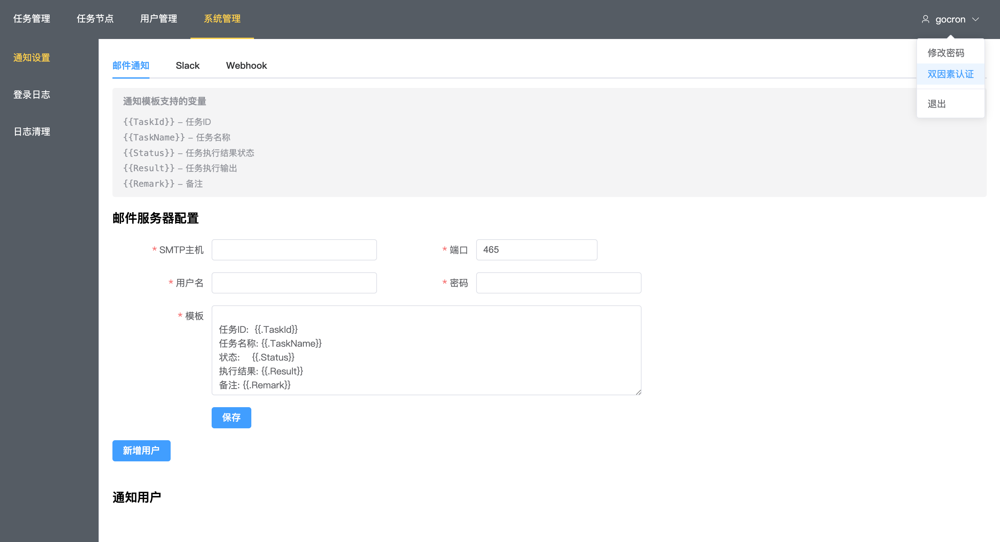

# gocron - 分布式定时任务管理系统

[](https://github.com/gocronx-team/gocron/releases) [](https://github.com/gocronx-team/gocron/releases) [](https://github.com/gocronx-team/gocron/blob/master/LICENSE)

[English](README_EN.md) | 简体中文

使用Go语言开发的轻量级分布式定时任务集中调度和管理系统，用于替代Linux-crontab。

## 功能特性

* Web界面管理定时任务
* crontab时间表达式，精确到秒
* 任务执行失败可重试
* 任务执行超时，强制结束
* 任务依赖配置
* 多用户与权限控制
* 双因素认证(2FA)
* 国际化支持（中文/英文界面切换）
* 多数据库支持（MySQL/PostgreSQL/SQLite）
* 任务类型
    * Shell任务 - 在任务节点上执行shell命令
    * HTTP任务 - 访问指定的URL地址
* 任务执行日志查看
* 日志自动清理（数据库日志和文件日志定时清理）
* 任务执行结果通知（邮件、Slack、Webhook）

## 界面截图

以下是系统的部分界面截图：








## 环境要求

* Go 1.23+
* 数据库：MySQL / PostgreSQL / SQLite（见下方说明）
* Node.js 20+ (前端开发)

## 数据库支持说明

| 部署方式 | MySQL | PostgreSQL | SQLite |
|---------|-------|------------|--------|
| Docker 部署 | ✅ 支持 | ✅ 支持 | ❌ 不支持 |
| 二进制部署 | ✅ 支持 | ✅ 支持 | ✅ 支持 |
| 开发环境 | ✅ 支持 | ✅ 支持 | ✅ 支持 |

**说明**：
- **Docker 部署**：由于跨平台编译限制，Docker 镜像不支持 SQLite，请使用 MySQL 或 PostgreSQL
- **二进制部署**：支持所有数据库，包括 SQLite（适合轻量级部署和测试）
- **生产环境推荐**：使用 MySQL 或 PostgreSQL，性能更好，支持分布式部署

## 快速开始

### Docker Compose 部署

使用 Docker 部署，需要本地构建镜像：

```bash
# 1. 克隆项目
git clone https://github.com/gocronx-team/gocron.git
cd gocron

# 2. 启动服务（自动构建镜像）
docker-compose up -d

# 3. 访问 Web 界面
# http://localhost:5920
```

**注意**：
- Docker Compose 仅部署 gocron 管理端，任务节点（gocron-node）需要单独安装部署
- Docker 镜像不支持 SQLite，请使用 MySQL 或 PostgreSQL 数据库
- 如需使用 SQLite，请使用二进制部署方式（见下方「生产部署」章节）
- 请参考下方「生产部署」章节中的 gocron-node 启动说明


### 开发环境

```bash
# 1. 克隆项目
git clone https://github.com/gocronx-team/gocron.git
cd gocron

# 2. 安装依赖
go mod download

# 3. 配置数据库
# 编辑 ~/.gocron/conf/app.ini
# MySQL/PostgreSQL 配置示例见项目根目录
# SQLite 配置: 复制 app.ini.sqlite.example

# 4. 启动后端（热更新）
air

# 5. 启动前端（另一个终端）
cd web/vue
yarn install
yarn run dev
```

访问 http://localhost:8080

### 二进制部署（推荐）

适合生产环境，支持所有数据库（包括 SQLite）：

```bash
# 1. 编译打包
make package

# 2. 解压对应平台的包
tar -xzf gocron-package/gocron-*.tar.gz
tar -xzf gocron-node-package/gocron-node-*.tar.gz

# 3. 启动服务
cd gocron-*
./gocron web

# 4. 启动任务节点（另一个终端）
cd gocron-node-*
./gocron-node
```

访问 http://localhost:5920

## 命令说明

### gocron

```bash
gocron web              # 启动Web服务
gocron web -p 8080      # 指定端口
gocron web -e dev       # 开发模式
gocron -v               # 查看版本
```

### gocron-node

```bash
gocron-node             # 启动任务节点
gocron-node -s :5921    # 指定监听地址
gocron-node -enable-tls # 启用TLS
```

## 技术栈

* 后端：Gin + GORM + gRPC
* 前端：Vue3 + Element Plus + Vite
* 定时任务：Cron
* 数据库：MySQL / PostgreSQL / SQLite

## 开发工具

### 基本构建
* `make build` - 编译项目（gocron + gocron-node）
* `make run` - 编译并运行（同时启动后端和节点）
* `make test` - 运行测试
* `make clean` - 清理构建文件

### 多平台打包
* `make package` - 构建当前平台包
* `make package-linux` - 构建 Linux 包（amd64, arm64）
* `make package-darwin` - 构建 macOS 包（amd64, arm64）
* `make package-windows` - 构建 Windows 包（amd64, arm64）
* `make package-all` - 构建所有平台包

### 前端开发
* `make build-vue` - 构建前端
* `make install-vue` - 安装前端依赖（yarn）
* `make run-vue` - 启动前端开发服务器（yarn）

### 代码质量
* `make lint` - 运行代码检查
* `make fmt` - 格式化代码
* `make vet` - 运行 go vet

### 开发工具
* `make dev-deps` - 安装开发依赖
* `air` - 后端热更新
* `yarn run dev` - 前端热更新
* `make help` - 显示所有可用命令

## 参与贡献

我们非常欢迎社区的贡献！无论是bug修复、新功能开发、文档完善还是问题反馈，都是对项目的宝贵支持。

### Git提交规范

为了保持项目历史的清晰和一致性，请遵循以下提交信息格式：

**基本格式**：
```
type(scope): subject

body

footer
```

**各部分详细说明**：
- **type**: 提交类型（必填）- 如 feat、fix、docs 等
- **scope**: 影响范围（可选）- 如 web、api、auth 等，用括号包围
- **subject**: 简短描述（必填）- 一句话说明本次提交做了什么
- **body**: 详细描述（可选）- 详细说明为什么做这个改动，如何实现的
- **footer**: 脚注信息（可选）- 如关闭的issue编号、破坏性变更说明等

**实际示例**：
```
feat(auth): 添加双因素认证功能

为了提高系统安全性，实现了基于TOTP的双因素认证：
- 支持Google Authenticator等认证应用
- 提供二维码和手动输入两种设置方式
- 完整的启用/禁用流程

Closes #123
```

**Type类型**：
- `feat`: 新功能
- `fix`: 修复bug
- `docs`: 文档更新
- `style`: 代码格式调整（不影响功能）
- `refactor`: 代码重构
- `test`: 测试相关
- `chore`: 构建过程或辅助工具的变动
- `perf`: 性能优化
- `ci`: CI/CD相关

**Scope范围**（可选）：
- `web`: 前端相关
- `api`: 后端API相关
- `node`: 任务节点相关
- `auth`: 认证相关
- `i18n`: 国际化相关
- `log`: 日志相关
- `db`: 数据库相关

**示例**：
```bash
feat(auth): 添加双因素认证功能
fix(web): 修复任务列表分页显示问题
docs(readme): 更新安装说明文档
refactor(api): 重构任务调度逻辑
```

### 如何参与

1. **Fork项目** - 点击右上角的Fork按钮
2. **创建分支** - `git checkout -b feature/your-feature`
3. **提交代码** - 遵循上述提交规范
4. **推送分支** - `git push origin feature/your-feature`
5. **创建PR** - 在GitHub上创建Pull Request

### 开发建议

- 提交前请运行 `make test` 确保测试通过
- 新功能请添加相应的测试用例
- 重要功能请更新相关文档
- 保持代码风格一致
- 提交信息请使用中文或英文，保持简洁明了

我们期待您的参与，让gocron变得更加完善！🚀

## 项目来源与致谢

这个项目是在 [gocron](https://github.com/ouqiang/gocron) 的基础上开发改造而来。我非常喜欢原项目的设计理念，但由于原作者不再维护，我在此基础上做了大量的重构工作，包括：

* 完全的国际化支持（中英文切换）
* 双因素认证(2FA)安全功能
* 日志自动清理系统
* 现代化的Vue3+Vite前端架构
* 后端Web框架重构（升级到现代化的[gin](https://github.com/gin-gonic/gin)框架）
* 数据库迁移工具重构（基于[gorm](https://github.com/go-gorm/gorm)的自动迁移系统）
* 多数据库支持（特别增加了SQLite支持，方便轻量级部署）
* 修复了若干关键问题（Shell任务停止功能、系统重启后孤立任务处理等）
* 更好的用户体验和界面设计

感谢原项目作者的付出，也希望大家多给项目点star、多提issue，鼓励项目的发展，让我们一起完善这个项目！
