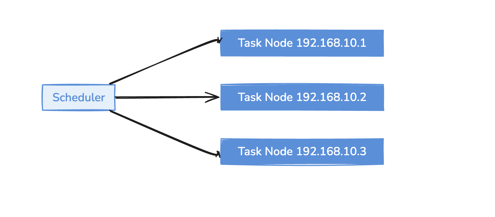
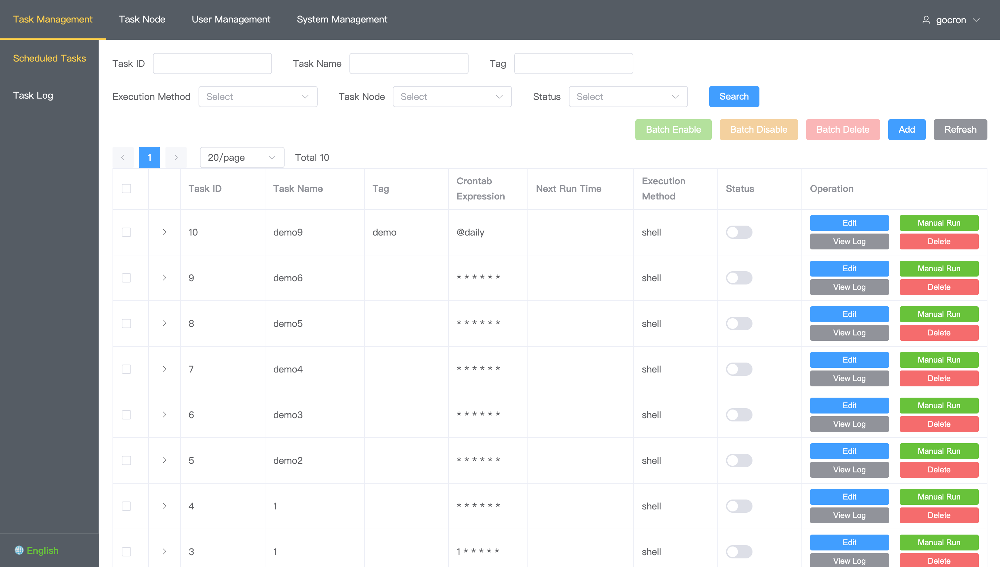
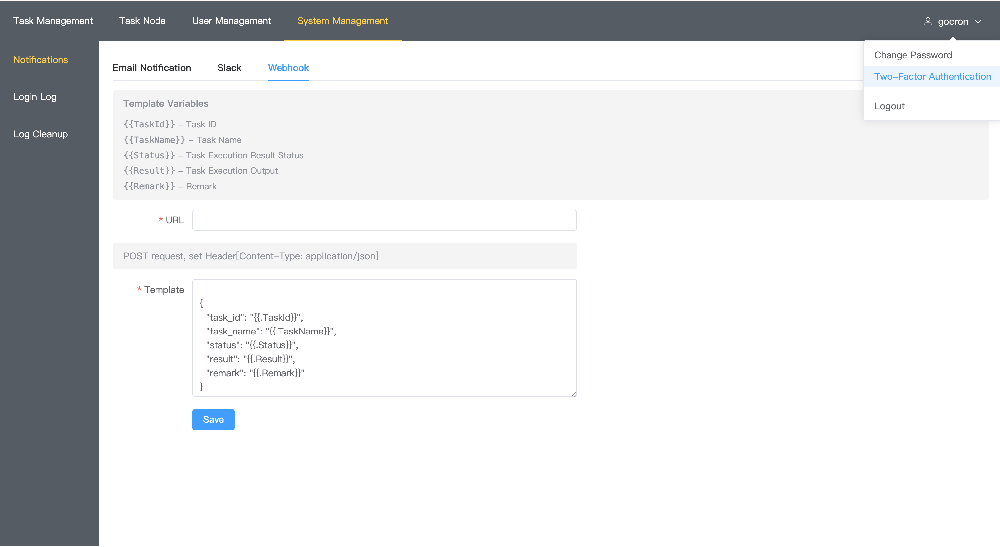

# gocron - Cron Task Management System

English | [简体中文](README.md)

A lightweight cron task management system developed in Go, designed to replace Linux-crontab.

## Features

* Web-based task management interface
* Crontab time expressions with second precision
* Task retry on failure
* Task timeout and forced termination
* Task dependency configuration
* Multi-user and permission control
* Two-Factor Authentication (2FA)
* Internationalization support (Chinese/English interface switching)
* Task types
    * Shell tasks - Execute shell commands on task nodes
    * HTTP tasks - Access specified URLs
* Task execution log viewing
* Automatic log cleanup (scheduled cleanup of database logs and log files)
* Task execution notifications (Email, Slack, Webhook)

## Screenshots

Here are some partial screenshots of the system:








## Requirements

* Go 1.23+
* MySQL/PostgreSQL/SQLite
* Node.js 18+ (for frontend development)

## Quick Start

### Development Environment

```bash
# 1. Clone the project
git clone https://github.com/gocronx-team/gocron.git
cd gocron

# 2. Install dependencies
go mod download

# 3. Configure database
# Edit ~/.gocron/conf/app.ini

# 4. Start backend (with hot reload)
air

# 5. Start frontend (in another terminal)
cd web/vue
yarn install
yarn run dev
```

Visit http://localhost:8080

### Production Deployment

```bash
# 1. Build
make package

# 2. Start service
./gocron web

# 3. Start task node
./gocron-node
```

Visit http://localhost:5920

## Commands

### gocron

```bash
gocron web              # Start web service
gocron web -p 8080      # Specify port
gocron web -e dev       # Development mode
gocron -v               # Show version
```

### gocron-node

```bash
gocron-node             # Start task node
gocron-node -s :5921    # Specify listening address
gocron-node -enable-tls # Enable TLS
```

## Tech Stack

* Backend: Gin + GORM + gRPC
* Frontend: Vue3 + Element Plus + Vite
* Scheduler: Cron
* Database: MySQL / PostgreSQL / SQLite

## Development Tools

### Basic Build
* `make build` - Build project (gocron + gocron-node)
* `make run` - Build and run (starts both backend and node)
* `make test` - Run tests
* `make clean` - Clean build files

### Multi-Platform Packaging
* `make package` - Build packages for current platform
* `make package-linux` - Build packages for Linux (amd64, arm64)
* `make package-darwin` - Build packages for macOS (amd64, arm64)
* `make package-windows` - Build packages for Windows (amd64, arm64)
* `make package-all` - Build packages for all platforms

### Frontend Development
* `make build-vue` - Build frontend
* `make install-vue` - Install frontend dependencies (yarn)
* `make run-vue` - Start frontend dev server (yarn)

### Code Quality
* `make lint` - Run code linter
* `make fmt` - Format code
* `make vet` - Run go vet

### Development Tools
* `make dev-deps` - Install development dependencies
* `air` - Backend hot reload
* `yarn run dev` - Frontend hot reload
* `make help` - Show all available commands

## Contributing

We warmly welcome community contributions! Whether it's bug fixes, new feature development, documentation improvements, or issue reports, all are valuable support for the project.

### Git Commit Convention

To maintain clear and consistent project history, please follow this commit message format:

**Basic Format**:
```
type(scope): subject

body

footer
```

**Detailed Component Description**:
- **type**: Commit type (required) - such as feat, fix, docs, etc.
- **scope**: Affected scope (optional) - such as web, api, auth, etc., in parentheses
- **subject**: Brief description (required) - one line explaining what this commit does
- **body**: Detailed description (optional) - explain why this change was made and how it was implemented
- **footer**: Footer information (optional) - such as closed issue numbers, breaking change notes, etc.

**Real Example**:
```
feat(auth): add two-factor authentication

To improve system security, implemented TOTP-based two-factor authentication:
- Support for Google Authenticator and other auth apps
- Provide both QR code and manual entry setup methods
- Complete enable/disable workflow

Closes #123
```

**Types**:
- `feat`: New feature
- `fix`: Bug fix
- `docs`: Documentation update
- `style`: Code formatting (no functional changes)
- `refactor`: Code refactoring
- `test`: Test related
- `chore`: Build process or auxiliary tool changes
- `perf`: Performance optimization
- `ci`: CI/CD related

**Scopes** (optional):
- `web`: Frontend related
- `api`: Backend API related
- `node`: Task node related
- `auth`: Authentication related
- `i18n`: Internationalization related
- `log`: Logging related
- `db`: Database related

**Examples**:
```bash
feat(auth): add two-factor authentication
fix(web): fix task list pagination display issue
docs(readme): update installation instructions
refactor(api): refactor task scheduling logic
```

### How to Contribute

1. **Fork the project** - Click the Fork button in the top right
2. **Create a branch** - `git checkout -b feature/your-feature`
3. **Commit code** - Follow the commit convention above
4. **Push branch** - `git push origin feature/your-feature`
5. **Create PR** - Create a Pull Request on GitHub

### Development Guidelines

- Run `make test` before committing to ensure tests pass
- Add corresponding test cases for new features
- Update relevant documentation for important features
- Maintain consistent code style
- Keep commit messages concise and clear in Chinese or English

We look forward to your participation in making gocron even better! 🚀

## Release Process

### Automated Release (Recommended)

1. **Create a tag release**:
   ```bash
   git tag -a v1.2.3 -m "Release v1.2.3"
   git push origin v1.2.3
   ```
   
2. **GitHub Actions automatically builds**:
   - Automatically builds binaries for all platforms
   - Automatically generates release notes
   - Automatically uploads to GitHub Releases

### Manual Release

1. **Through GitHub interface**:
   - Visit the project's Actions page
   - Select "Manual Release" workflow
   - Click "Run workflow"
   - Enter version number and release notes
   - Execute release

### Release Content

Each release includes binaries for the following platforms:
- **Linux**: amd64, arm64
- **macOS**: amd64, arm64  
- **Windows**: amd64, arm64

Includes two components:
- `gocron`: Web server
- `gocron-node`: Task execution node

## Project Origin & Acknowledgments

This project is developed and refactored based on [gocron](https://github.com/ouqiang/gocron). I really appreciate the design philosophy of the original project, but since the original author is no longer maintaining it, I have done extensive refactoring work on this foundation, including:

* Complete internationalization support (Chinese/English switching)
* Two-Factor Authentication (2FA) security features
* Automatic log cleanup system
* Modern Vue3 frontend architecture
* Backend web framework refactoring (upgraded to modern [gin](https://github.com/gin-gonic/gin) framework)
* Database migration tool refactoring ([gorm](https://github.com/go-gorm/gorm)-based automatic migration system)
* Better user experience and interface design

Thanks to the original project author for their contribution. I also hope everyone will give the project more stars and submit more issues to encourage the project's development. Let's improve this project together!

## License

MIT
